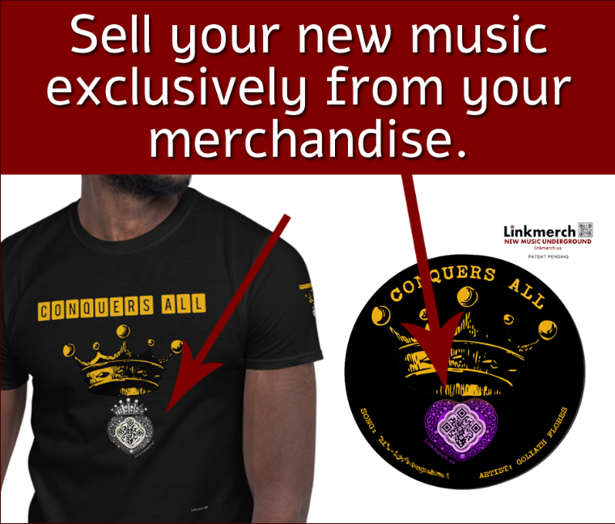

## Project Overview

This website will allow users to purchase items (cloths, stickers, etc.) and with those items, generate a unique QR code that will be displayed along with the designs of the item. The website will generate a page associated with that QR code with a chosen template that the user will be able to access and edit, giving them a personalized webpage to share with anyone that scans their item.

Whether it's a business card that links to a more verbose page about who they are along with their social media links, a sticker sold locally by an artist that contains their music or a gallery of their art, a shirt for kids that contains emergency contact information in case they get lost, or just an advertisement for your local business on the back of your shirt that someone can scan while waiting behind you in line, the website will allow anyone to incorporate technology into their everyday things.

## Functionality

The user will be able to browse the marketplace from the homepage. From there, they can also sign up or log into their account. On their profile page, they will be able to generate unique URL paths to chosen templates. When they do so, a link to those URL paths will be provided, as well as a QR code image associated with the path that may be saved and used as desired.  On those pages, the users who created them will be able to edit the template that renders on the page. Anyone with a link to the page will be able to see what information its author has filled out there.

All the items in the store have locations where a QR code is displayed. Upon purchase of an item, a user picks one of their QR codes to be dispalyed on the item. 
Their QR codes are then placed on the item and shipped to the customer.

## Data Model

***models listed are for 3 week milestone***
#### CustomUserModel
- username *CharField*
- first name *CharField*
- last name *CharField*
- email *EmailField*
- *nested ***Custom Urls****

#### CustomURLs
- unique_key *CharField*
- template_key *IntegerField*
- *nested ***Custom Users***

## TODO
- finish customizing QR codes
- add dialoge box to delete requests
- add margin to the bottom of emergency qr code
- use tiny url API to shorten codes

